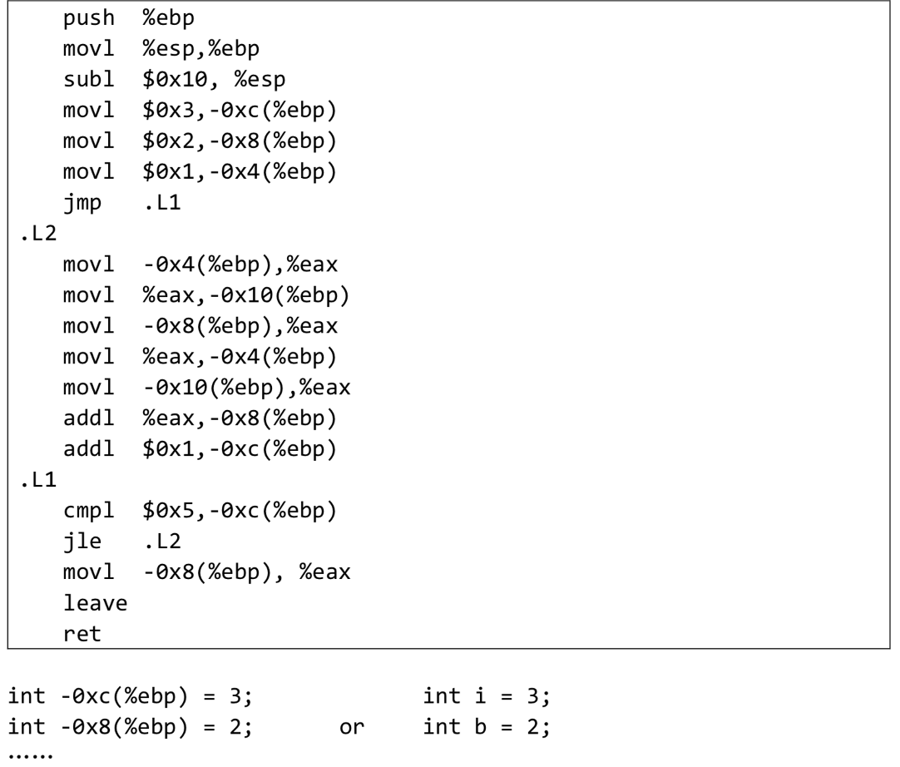

## Homework4
姓名:甘智乾
学号：2024201530

------------------------------
### Q1(1)
##### Assume we have following address binding table and value of registers : 

| Address | Value | Register | Value| 
|---------|-------|----------|------|
| 0x100   | 0x10  |   %eax   | 0x10 |
| 0x110   | 0x11  |   %ebx   | 0x100|
| 0x120   | 0x12  |          |      |
|    ...  |  ...  |    ...   |  ... |
| 0x190   |  0x19 |          |     |
| 0x200   |  0x20 |          |     |

#### Answer1(1)
##### Please fill in the table below 

|Operand | Value|
|--------|-----|
|%ebx|0x100  |
|$0x150|0x150  |
|0x170|0x17  |
|(%ebx)|0x10 |
|(%ebx,%eax)|0x11 |
|0x30(%ebx)|0x13 |
|80(%ebx,%eax,2)|0x17  |
###### 思路
1.%ebx=0x100,[0x100]=0x10
2.(%ebx,%eax)=[0x100+0x10]=[0x110]=0x11
3.0x30(%ebx)=[0x100+0x30]=[0x130]=0x13
4.80=0x50,80(%ebx,%eax,2)=[0x50+0x100+0x10*2]=[0x170]=0x17
### Q1(2)
##### Suppose registers and bound values will be reset as above after each instruction. Please fill in the table below: (Write all if there are more than one destinations and None if there is no destination) 

#### Answer1(2)
| Instruction | Destination | Value |
| ----------- | ----------  | ----  |
addl %eax,%ebx |%ebx  |0x110  |
subl %eax,(%ebx) |0x100  |0  |
leal 0x50(%eax), %edx |%edx   |0x60  |
movzbl %al, %ebx |%ebx |0x10 |
movsbl %bh, %ecx |%ecx |0x01  |
   

### Q1(3)
##### Assume the initial value of the flags is 0. Fill the table below 
#### Answer1(3)
| Instruction | OF | SF | ZF | CF|
| ----------- | -- | -- | ---|---| 
leal(%eax),%ebx|0 |0  | 0 |0 |
subl %ebx, %eax|0 |0 |1 |0  |
xorl %eax, %eax|0  |0  |1 |0 |
test %eax, %ebx|0  |0  |1  |0 |
##### 思路
1.leal不改变标志，但使%ebx=0x10。所以都为0。
2.subl操作使得%eax=0x10-0x10=0,所以ZF=1，其它为0。
3.由于x^x=0,所以%eax=0,所以ZF=1，其它为0。
4.由于%eax&%ebx=0,所以ZF=1，其它为0。

### Q2
- Translate the following assembly into C codes.
- You can name local variables represented by -12(%ebp), -8(%ebp)...or a,b,c... freely as you like. 
- The beginning of C codes is given. 
  



#### Answer2
```c
(){
    int i=3;
    int b=2;
    int a=1;
    while(i<<5){
        int d=a;
        a=b;
        b=b+d;
        i++;
    }
    return b;
}
```
##### 解释
1.一开始我是逐行对应C代码，得如下：
```c
-0x10(%ebp)=d;
-0xc(%ebp)=i;
-0x8(%ebp)=b;
-0x4(%ebp)=a;
%eax=val;
(){
    int i=3;
    int b=2;
    int a=1;
    int val;
    while(i<<5){
        val=a;
        d=val;
        val=b;
        a=val;
        val=d;
        b=b+val;
        i++;
    }
    val=b;
    return val;
}
```
二.1.发现在很多情况下，val只起到一个中间变量的作用。
像:
```c
1. val=a;
    d=val;

2.  val=b;
    a=val;

3.  val=d;
    b=b+val;
```
2.同时紧接者val变量又会被赋予另一个值，也就因为者val的值不会被之后的过程需要。
3.因而，可以直接合并。
